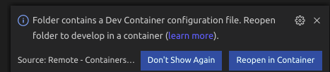
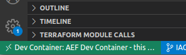
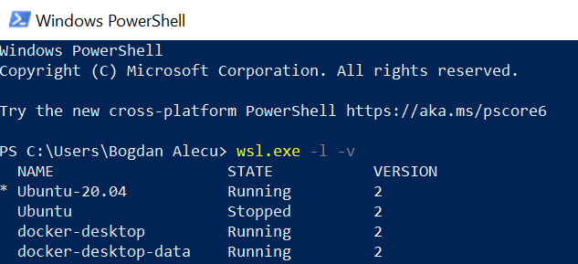
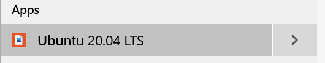
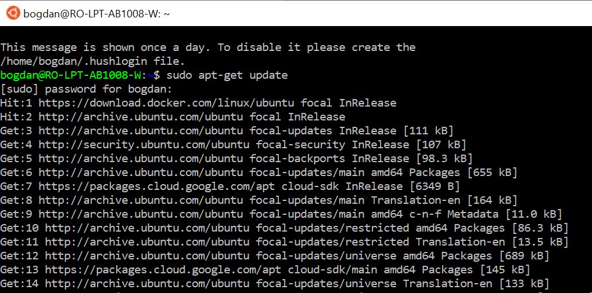
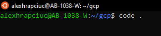
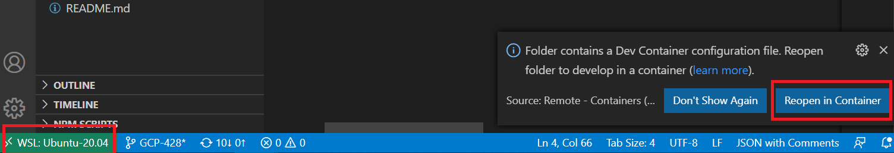

# Visual Studio Code Remote - Containers

The Visual Studio Code Remote - Containers extension lets you use a
  Docker container as a full-featured development environment. [(more info)](https://code.visualstudio.com/docs/remote/containers)

## Usage of remote development containers on Ubuntu/MacOS

### Prerequisites

1. Ensure you are able to `git clone/pull/push` on this repo. There are various
   ways of authenticating e.g.
   <!-- markdown-link-check-disable -->
   [SSH](https://docs.github.com/en/free-pro-team@latest/github/authenticating-to-github/connecting-to-github-with-ssh)
   or a [Personal
   token](https://docs.github.com/en/free-pro-team@latest/github/authenticating-to-github/creating-a-personal-access-token)
   <!-- markdown-link-check-enable -->
1. Clone the intended repo.
1. In case you have already installed `git, gcloud, docker for desktop and
   Visual Studio code`, the next step is no longer needed. You can check
   this by running `git --version && gcloud --version && docker --version &&
   code --version` in your terminal.
1. (Optional): Go to [this location](../scripts) and run the appropriate setup script
  [setup-ubuntu](../scripts/setup-ubuntu) or [setup-mac](../scripts/setup-mac)

1. Authenticate to GCP and Google Container Registry by using your Google credentials:

```bash
# You need to run this daily (expires after 8 hours)
gcloud auth login --update-adc
# You only need to run this once on your laptop
gcloud auth configure-docker
```

   Click on the generated link and follow the on screen instructions.

### Using the dev container

1. Open a terminal and go to the location of your cloned repo. Open Visual
   Studio Code by typing `code .` in your terminal. :warning: For MacOS use
   [these
   instructions](https://code.visualstudio.com/docs/setup/mac#_launching-from-the-command-line)
1. Install Remote - Containers extension following the instructions documented into
  this [article](https://marketplace.visualstudio.com/items?itemName=ms-vscode-remote.vscode-remote-extensionpack)
1. A pop-up window will be displayed in the bottom right corner.

  

   If you missed the pop-up you can hit `F1` and type `reopen folder in container`.
   You can check if the switch to`devcontainer` was done by
   checking in the bottom left corner for:

  

If you need some custom configurations or other tools to be available
  inside the container, you can add them to `postCreateCommand` field
  in the [devcontainer.json](../.devcontainer/devcontainer.json).
  [more info](https://code.visualstudio.com/docs/remote/devcontainerjson-reference).

  `NOTE:` For changes made into [devcontainer.json](../.devcontainer/devcontainer.json)
  to take effect, you need to `Rebuild the container`.
  To `Rebuild` the `devcontainer` you need to press `F1` and type
  `rebuild and reopen in container`.

## Usage of remote development containers on Windows

### Prerequisites for Windows

1. Enable the Windows Subsystem for Linux

   You must first enable the "Windows Subsystem for Linux" optional feature
   before installing any Linux distributions on Windows. Open PowerShell as
   Administrator and run:

   ```powershell
   dism.exe /online /enable-feature /featurename:Microsoft-Windows-Subsystem-Linux
    /all /norestart
   ```

1. Enable Virtual Machine feature

   Open PowerShell as Administrator and run:

   ```powershell
   dism.exe /online /enable-feature /featurename:VirtualMachinePlatform /all /norestart
   ```

1. Download the latest Linux kernel update package

   Download the [update
   package](https://wslstorestorage.blob.core.windows.net/wslblob/wsl_update_x64.msi)
   and run the update package downloaded (you will be prompted for elevated
   permissions, select ‘yes’ to approve this installation)

1. Set WSL 2 as your default version

   Run the following command in PowerShell:

   ```powershell
   wsl --set-default-version 2
   ```

1. Install Ubuntu 20 LTS distribution

<!-- markdown-link-check-disable -->

   Open the [Microsoft Store](https://aka.ms/wslstore) and search for `ubuntu`
   in the top right.

<!-- markdown-link-check-enable -->

   

   Select `Ubuntu 20 LTS` and click on the `Get` button.

   

   The first time you launch a newly installed Linux distribution, a console
   window will open and you'll be asked to wait for a minute or two for files to
   de-compress and be stored on your PC. All future launches should take less
   than a second. You will then need to create a user account and password for
   your new Linux distribution.

   

### Docker desktop setup

1. Set your newly installed distro as a default

   Open again PowerShell as Admin and run

   ```powershell
   wsl.exe -l -v
   ```

   

   Write down the name you see as output for the Ubuntu 20 distro and then run

   ```powershell
   wsl --set-default <distro name>
   ```

1. Configure your local Ubuntu

   From the Start menu, search for `ubuntu`, select `Ubuntu 20 LTS` and click on
   it

   

   Once the Ubuntu machine has started, you need to configure it to support
   remote containers development. You'll need first to install git:

   ```shell
   sudo apt-get update
   sudo apt-get install git
   cd ~
   ```

   

   The last command makes sure you're in the home directory of your newly
   created user. Now you can clone the rep and go to `scripts` folder and follow
   the [initial setup steps](/CONTRIBUTING.MD). These steps will configure your
   Ubuntu VM with all the packages needed in order for you to start developing
   in remote containers.

1. Authenticate to GCP and Google Container Registry by using your Google credentials:

```bash
# You need to run this daily (expires after 8 hours)
gcloud auth login --update-adc
# You only need to run this once on your laptop
gcloud auth configure-docker
```

  Now install Docker desktop

   Download [Docker
   Desktop](https://hub.docker.com/editions/community/docker-ce-desktop-windows/)
   and install it. Follow the usual installation instructions to install Docker
   Desktop. If you are running a supported system, Docker Desktop prompts you to
   enable WSL 2 during installation. Start Docker Desktop from the Windows Start
   menu and select `Settings > General` and make sure `Use WSL 2 based engine`
   is checked.

   

### Using the dev container on Windows

1. Now that you have everything setup, it's time to install [Visual Studio
   Code](https://code.visualstudio.com/download) in case you don't have it
   already. The installation should be done on your Windows system and not on
   the Ubuntu VM.

1. Install Remote Containers extension by [going
    here](https://marketplace.visualstudio.com/items?itemName=ms-vscode-remote.remote-containers)
    and press on the Install button.

1. Use remote containers by opening the Ubuntu VM and going into your user's
    home and target repo. Once you're there, just type `code .` which will open
    the VS Code with the WSL support.

    You should get a prompt saying that it has detected the presence of Remote
    Container config, so just click on the prompt and you're ready to go. Also
    notice that in the bottom left of your Visual Studio code you should first
    see that it's using WSL2 integration, indicating that you opened it corectly
    from your Ubuntu VM. Once you switch to container development, it should
    change to `Dev Container`. Happy coding!

    

    

    
